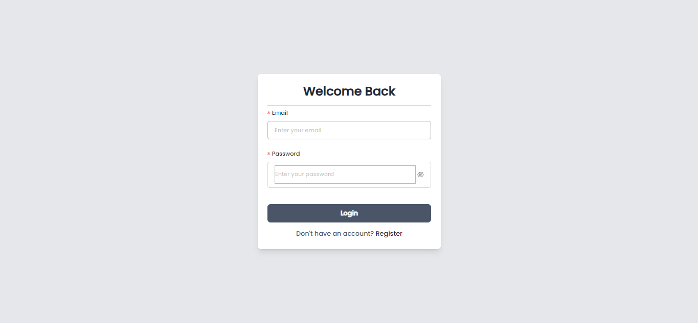
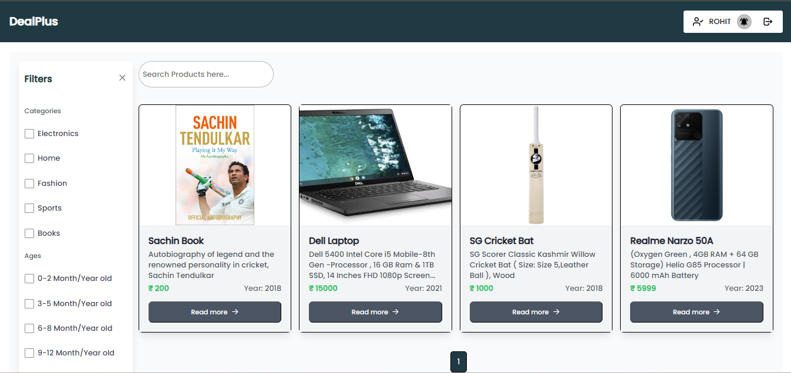
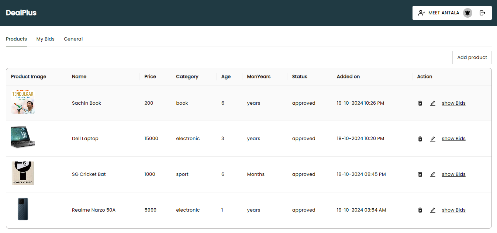
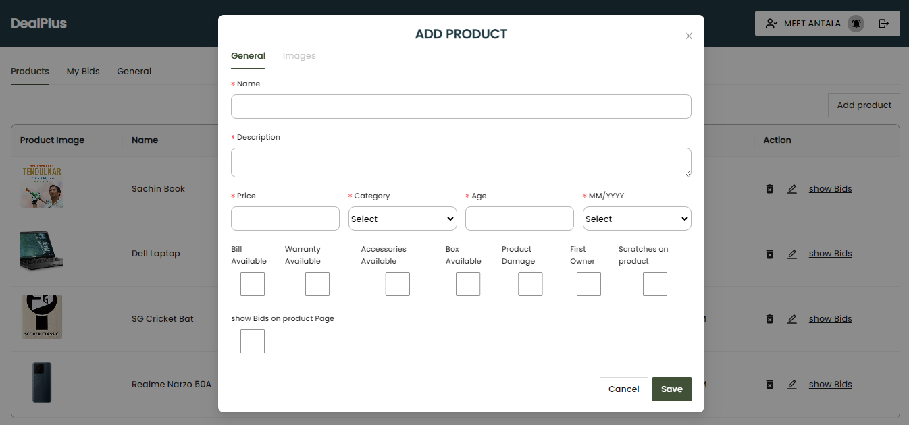
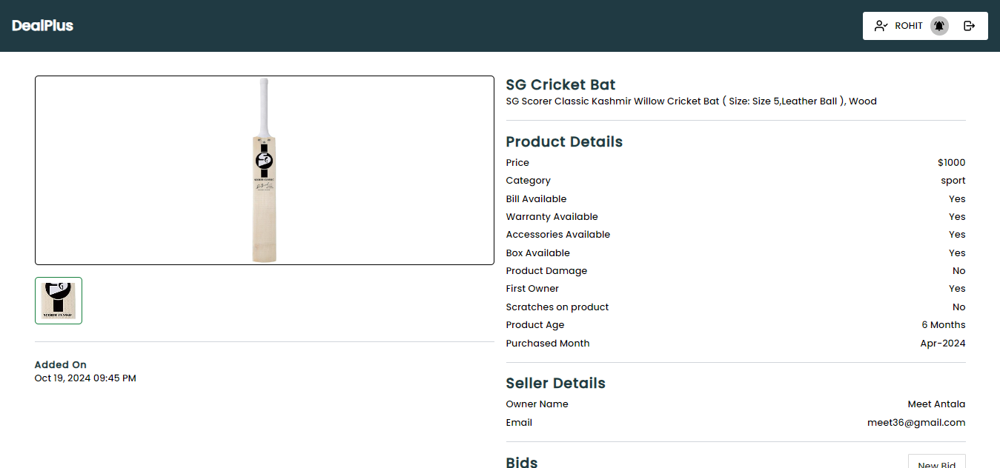

# 🛍️ DealPlus - Marketplace for Buyers and Sellers

**DealPlus** is a full-featured MERN stack web application that replicates the core functionality of OLX, enabling users to buy and sell products online. Users can view products, filter them by category, upload their own listings with images and even bid on products.

## 🚀 Features

- 🔐 Authentication using JWT
- 📤 Cloudinary Storage integration for image uploads
- 📦 Product listing with images, description, price, and category
- 🔍 Advanced search and category-based filtering
- 💸 Product bidding (simple)
- 🧑‍💼 Profile dashboard to manage products and bids
- 🔄 Persistent login using localStorage

## 🛠️ Tech Stack

- **React.js**
- **Node.js**
- **Express.js**
- **MongoDB**
- **Mongoose**
- **JWT (JSON Web Tokens)** – User authentication
- **bcrypt** – Password hashing
- **Cloudinary** – Cloud-based image hosting

## 📸 Screenshots

