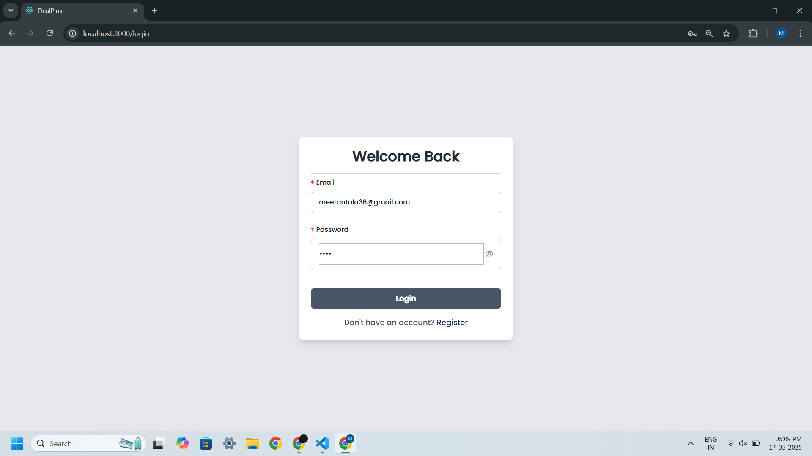
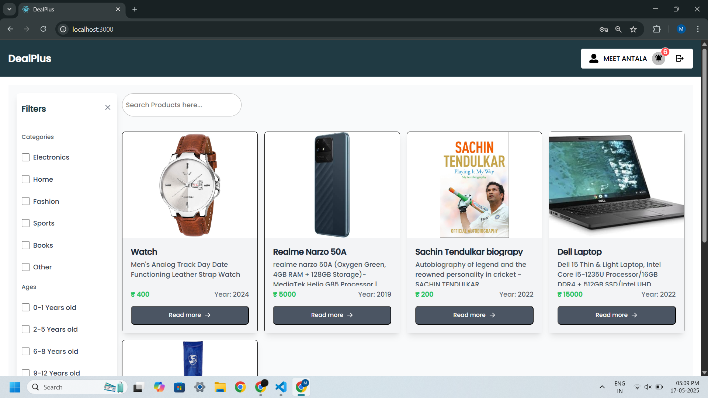
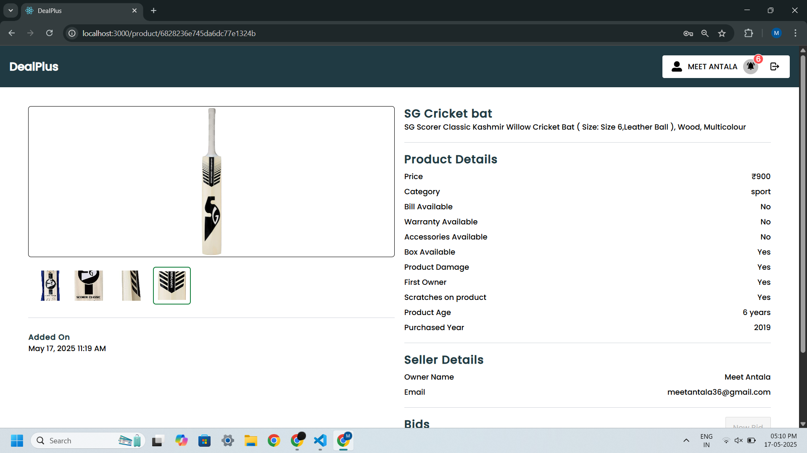
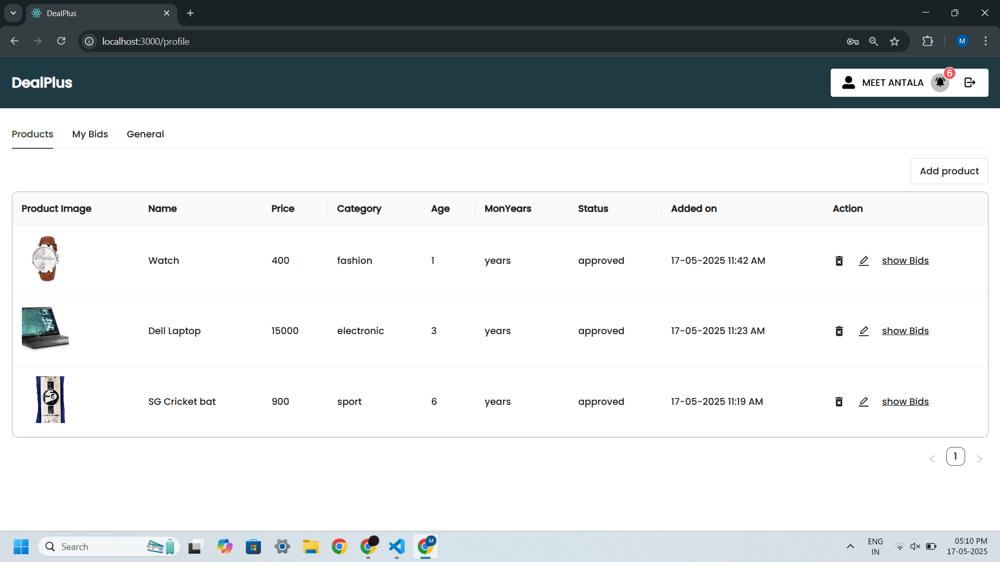
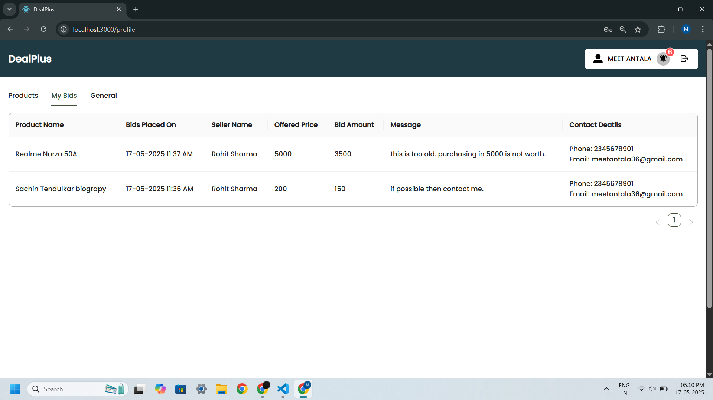
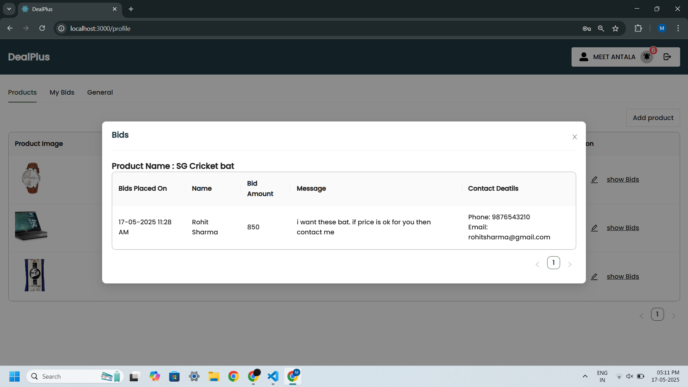
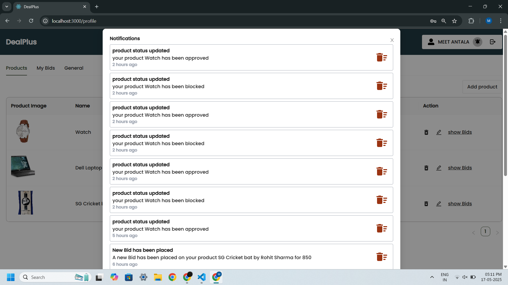
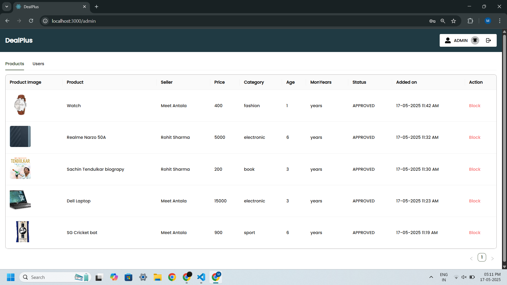

# 🛍️ DealPlus - Marketplace for Buyers and Sellers

 - Developed a MERN stack-based online market place enabling users to buy or sell pre-owned products.
 - Implemented product listings, bidding system, and advanced search and filtering.
 - Utilized Ant Design (antd) library for building a responsive and consistent UI, with secure authentication
 using JWT and used Cloudinary for storing images of products.

## 🚀 Features

- 🔐 Authentication using JWT
- 📤 Cloudinary Storage integration for image uploads
- 📦 Product listing with images, description, price, and category
- 🔍 Advanced search and category-based filtering
- 💸 Product bidding (simple)
- 🧑‍💼 Profile dashboard to manage products and bids
- 🔄 Persistent login using localStorage

## 🛠️ Tech Stack

- **React.js**
- **Node.js**
- **Express.js**
- **MongoDB**
- **Mongoose**
- **JWT (JSON Web Tokens)** – User authentication
- **bcrypt** – Password hashing
- **Cloudinary** – Cloud-based image hosting

## 📸 Screenshots

